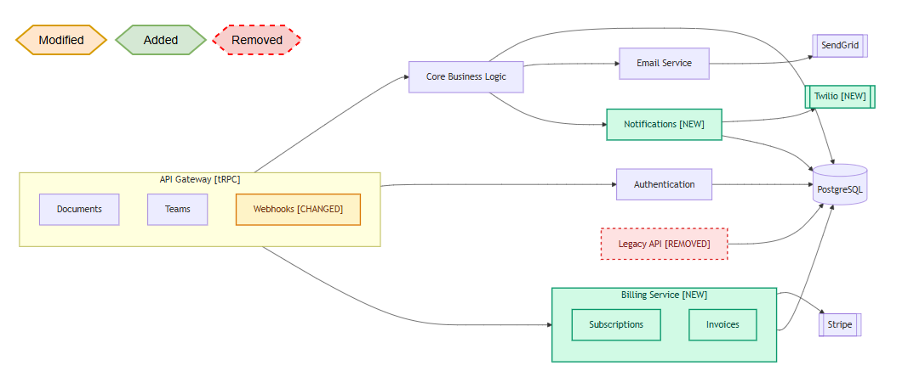

# unkode

> Catch architectural drift on every PR. See what changed, not just how.

AI agents now write code faster than humans can review it. That speed comes at a cost — architecture drifts. New dependencies appear, boundaries break, and nobody notices until the system is unrecognizable.

**unkode** makes architectural changes visible on every pull request. A color-coded diff shows exactly which modules were added, removed, or rewired. The architecture map stays in sync with the code — automatically, in the repo, versioned like everything else.

Visit **[unkode.dev](https://unkode.dev)** for docs and updates. 

---

## What it looks like

On every PR, unkode posts a diff diagram showing exactly what changed in the architecture:



Green modules are new, red are removed, amber are modified. Everything else stays neutral so changes jump out immediately.

Two files live in your repo:

- `unkode.yaml` — the architecture as structured data (source of truth)
- `arch_map.md` — the rendered Mermaid diagram of the current state (auto-generated)

---

## Quick setup

One-time setup per repository.

### 1. Copy the skill to your repo

unkode ships as a Claude Code skill (also compatible with other agents that read `.agents/skills/`).

```bash
# For Claude Code
cp -r unkode/skills/unkode .claude/skills/unkode

# For other agents (Codex, Cursor, Aider, etc.)
cp -r unkode/skills/unkode .agents/skills/unkode
```

### 2. Generate the baseline

In Claude Code, from your repo root:

```
/unkode
```

The first run analyzes your codebase and creates `unkode.yaml` + `arch_map.md`. Commit both to main as your baseline.

### 3. (Recommended) Add the GitHub Action

On every PR, the action posts a color-coded diff diagram showing exactly what changed architecturally. Without it, drift still gets caught, but reviewers have to read the YAML manually.

```bash
# Copy the action
mkdir -p .github/actions/unkode
cp unkode/config/github/action.yml .github/actions/unkode/action.yml

# Copy the workflow
cp unkode/config/github/unkode_arch_check.yml .github/workflows/unkode_arch_check.yml
```

---

## Dev workflow

Once setup is done, this is what your day-to-day looks like:

```
 ┌─────────────┐     ┌───────────────┐      ┌─────────────┐
 │ You edit    │────▶│ /unkode       │────▶│ unkode.yaml │
 │ code        │     │ (Coding agent)│      │ updated     │
 └─────────────┘     └───────────────┘      └──────┬──────┘
                                                   │
                                            ┌──────▼──────┐
                                            │ Script      │
                                            │ regenerates │
                                            │ Mermaid     │
                                            └──────┬──────┘
                                                   │
                            ┌──────────────────────┴──────────────────┐
                            │                                         │
                     ┌──────▼──────┐                          ┌───────▼──────┐
                     │ Commit      │                          │ PR opened    │
                     │ unkode.yaml │                          │ GitHub Action│
                     │ to branch   │                          │ posts diff   │
                     └─────────────┘                          └──────────────┘
```

1. **Make code changes** on a branch as you normally would.
2. **Run `/unkode`** before pushing. It updates `unkode.yaml` incrementally and regenerates `arch_map.md`.
3. **Commit and open a PR.** The GitHub Action posts a color-coded diff diagram as a PR comment showing what changed architecturally.
4. **Merge.** The updated `unkode.yaml` on main becomes the new baseline for future PRs.

---

## Config

Edit `.claude/skills/unkode/config.yaml` (or `.agents/skills/unkode/config.yaml`):

```yaml
# The branch to compare against for diffs
base_branch: main

# Directories to ignore when analyzing the codebase
exclude_paths: []

# Diagram flow direction: LR (left-right) or TB (top-bottom)
diagram_direction: LR
```

---

## Token usage & cost

unkode is frugal. Running it doesn't burn through your subscription.

| Operation | When | Typical tokens | Time |
|-----------|------|----------------|------|
| `/unkode` (first time) | Once per repo, on `main` | ~4,000 tokens | ~3 min |
| `/unkode` (dev workflow) | Per branch, before PR | 500–1,000 tokens | ~1 min |
| Mermaid diagram generation | Every run | 0 tokens | instant |
| PR diff on GitHub Action | Every PR | 0 tokens | seconds |

The first run depends less on codebase size and more on **how well-documented the project is**. A 1.5M LOC monorepo with clear package boundaries and READMEs costs roughly the same as a smaller but less organized repo. For best results, add README files and module-level docs before running unkode for the first time — the agent picks up context quickly and produces a sharper architecture map.

Incremental syncs are cheap — they only read the files that changed, not the whole codebase. The Mermaid generation and PR diff are deterministic and rule-based — no agent involvement, no tokens used.

---

## Why unkode

- **AI writes code 10x faster. Architecture drifts 10x faster too.** unkode flags drift on every PR so nothing slips through.
- **PRs hide architectural impact.** Code diffs don't show "this PR added a direct database dependency from the frontend." unkode does.
- **Diagrams in Confluence go stale. Diagrams in your repo don't.** Versioned, diffable, always the truth.
- **No vendor lock-in.** The YAML is yours. The Mermaid is yours. The tooling is open source. Use any diagram editor, any AI agent.

---

## Feedback

unkode is early. What's working, what isn't, what would make it valuable for your team — please share.

- **Bugs and feature requests:** [GitHub Issues](https://github.com/deepcodersinc/unkode/issues)
- **Discussion, ideas, questions:** [GitHub Discussions](https://github.com/deepcodersinc/unkode/discussions)

---

## License

Apache 2.0 — see [LICENSE](LICENSE)

---

## Links

- Website: [unkode.dev](https://unkode.dev)
